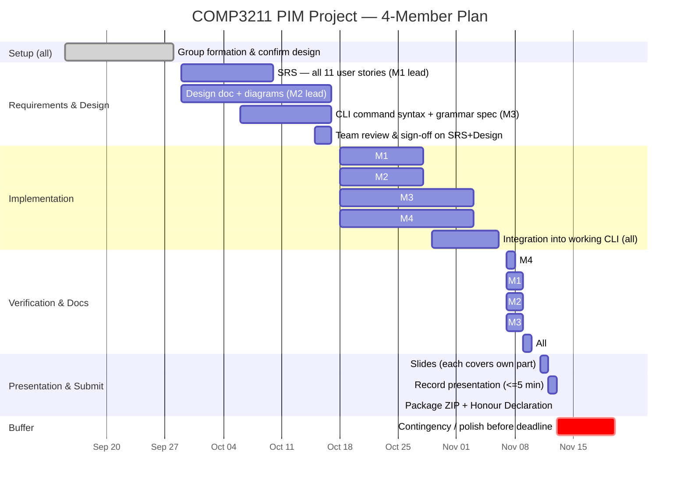

# PIM CLI System — Design Spec

Course: COMP3211 Software Engineering (Fall 2026), Prof. Max Yu Pei
Assignment: [Project Description - 2026.pdf](../../../Project%20Description%20-%202026.pdf)
Deadline: group forming 2026-09-28 09:00; final submission 2026-11-20 20:00
Status: draft — pending group review

## 1. Scope

Command-line Personal Information Management (PIM) system supporting all 11 user
stories in Appendix B of the project description (US1–US11): creating typed
personal information records (PIRs) — plain notes, tasks, events, contacts —
editing them, searching with a boolean criteria language, printing, deleting,
and saving/loading to `.pim` files.

Language/paradigm: **Python, object-oriented.**

Out of scope (per assignment instructions — no extra credit for these):
GUI, networked/online use, anything beyond the 11 user stories.

## 2. Architecture

MVC, adapted for a CLI (View = console formatter, not widgets; Controller =
the read-command loop). This satisfies the assignment's explicit requirement
to place all model code in a package named `model`.

```
pim/
  model/
    pir.py        # PIR (abstract base), Note, Task, Event, Contact, PIR_REGISTRY
    criteria.py    # Criterion tree used by search (see §4)
    repository.py  # PIRRepository: in-memory store, CRUD, search
    storage.py     # PimFileStorage: save/load .pim files (JSON)
    errors.py      # ValidationError, PIRNotFoundError, ParseError, StorageError
  controller/
    parser.py      # command-line tokenizer + criterion-grammar parser
    commands.py     # dispatch table: command name -> handler
  view/
    presenter.py   # formats PIRs/messages for console output
  main.py           # wires model+controller+view, runs the REPL
```

`storage.py` lives in `model`, not a separate layer: it only operates on
model objects and has no CLI/presentation concerns, and keeping it there
means save/load round-trips are covered by the unit-test deliverable, which
is scoped to the model package only.

## 3. Domain model

`PIR` (abstract base): `id: int` (auto-increment), `created_at`,
`modified_at`, abstract `to_dict()` / `from_dict()`.

| Class | Fields | User story |
|---|---|---|
| `Note` | `text: str` | US2 |
| `Task` | `description: str`, `deadline: datetime` | US3 |
| `Event` | `description: str`, `start_time: datetime`, `alarm: datetime` | US4 |
| `Contact` | `name: str`, `address: str`, `mobile_number: str` | US5 |

**Resolved ambiguity — `Event.alarm`:** the assignment doesn't say whether
alarm is an absolute time or a duration before `start_time`. Decision: it's
an absolute `datetime`, validated at creation/edit time to be `<= start_time`.
This keeps it structurally identical to `Task.deadline` for the purposes of
US7's time comparison operators (`<`, `>`, `=`), avoiding special-cased
duration arithmetic in the criteria evaluator.

**Extendibility fix:** each subclass self-registers into a `PIR_REGISTRY: dict[str, type[PIR]]`
via a class decorator. `add`, `PIR.from_dict`, and the criterion parser's
`type=` field all resolve through this registry instead of an `if/elif`
chain, so adding a 5th PIR type touches one file.

`PIRRepository` holds PIRs in `{id: PIR}`, exposes `add`, `update(id, **fields)`
(US6), `delete(id)` (US9), `get(id)`, `get_all()`, and `search(criterion)`
(US7) which filters via `criterion.matches(pir)`.

## 4. Search criteria (US7)

Composite pattern:
- `Criterion` (interface): `matches(pir) -> bool`
- `FieldCriterion(field, op, value)` — leaf. `op` is one of `contains` (text
  fields: note text, description, name, address, mobile number) or `<`, `>`,
  `=` (time fields: deadline, start_time, alarm).
- `AndCriterion`, `OrCriterion`, `NotCriterion` — composites over `&&`, `||`, `!`.

A hand-written recursive-descent parser (`controller/parser.py`) turns a
query string into a `Criterion` tree. Precedence, tightest first: `!`, `&&`,
`||`; parentheses override. Standard library only (no `eval`).

Rejected alternatives: a flat AND-only condition list (fails US7's
requirement for `||`/`!`/nesting — costs requirements coverage); `eval()` on
a translated boolean string (arbitrary code execution risk, reads poorly in
a design document).

**Open item for the group:** exact command syntax for `add`, `search`, `edit`,
etc. must be finalized during the SRS/Design phase (owned by M3, see §7) —
three downstream deliverables (user manual, requirements-coverage report,
unit test fixtures) depend on it being stable before implementation starts.

## 5. Persistence (US10/US11)

`.pim` files are JSON: an array of PIR dicts, each tagged with a `"type"`
field resolved through `PIR_REGISTRY` on load. Rejected `pickle`: not
human-readable, executes arbitrary code on load (reliability/security risk),
harder to write a meaningful corrupt-file test against.

## 6. Error handling

Exception hierarchy in `model/errors.py`: `ValidationError`,
`PIRNotFoundError`, `ParseError`, `StorageError`. Raised in the model,
caught in the Controller, turned into a friendly message by the View. No
malformed input or corrupt `.pim` file should crash the REPL — this is
written as an explicit, verifiable non-functional requirement in the SRS,
not left implicit.

## 7. Non-functional requirements (for the SRS — verifiable phrasing)

- **Reliability:** the system shall not terminate on malformed command input
  or a corrupt `.pim` file; it shall print an error message and continue.
- **Portability/constraint:** the system shall only import Python
  standard-library modules at runtime. (Dev-only tooling, e.g. `coverage.py`
  for the test-coverage report, is exempt — it's not imported by shipped
  code.)
- **Usability:** every command shall have a `help` entry; an invalid command
  shall print its correct usage rather than a stack trace.
- **Efficiency:** not a design concern at the expected scale of a personal
  PIM (tens to low thousands of records) — an in-memory dict + O(n) search
  is sufficient; no indexing needed.

## 8. Testing strategy

Unit tests target `model` only, per the assignment:
- `pir.py`: field validation per type (e.g. `Task` requires a `deadline`,
  `Event.alarm <= start_time`).
- `repository.py`: CRUD + search correctness.
- `criteria.py` + parser: round-trip on nested/parenthesized boolean
  expressions; malformed input raises `ParseError`.
- `storage.py`: save/load round trip; corrupt-file handling raises `StorageError`.

Coverage measured with `coverage.py` (dev-time only, see §7).

## 9. Team plan (4 members)

| Member | Owns |
|---|---|
| M1 | SRS lead, `Note`/`Contact` classes, user manual |
| M2 | Design document lead (diagrams), `Task`/`Event` classes, developer manual |
| M3 | Command grammar spec, `Criterion` parser + Controller, requirements-coverage report |
| M4 | `Repository`/`Storage` (JSON persistence) + View, test-coverage report |

All four implement, all four present (>=1 minute each, per the assignment's
requirement to show face/ID). This is deliberate: the individual grading
formula `min(x*y*z%, x)` rewards documented individual contribution, and
component ownership makes the Honour Declaration's contribution percentages
defensible rather than assumed-equal.

## 10. Timeline

Internal completion target **2026-11-13** — one week of buffer before the
hard deadline (2026-11-20 20:00).



Rendered export checked against this source: `COMP3211 PIM Project-2026-09-15-144047.png`
(project root). Single-day tasks in "Verification & Docs" and the
zero-duration tasks in "Presentation & Submit" render with truncated/no
visible bars — cosmetic; widen to 2-day spans if a cleaner report image is
wanted.

## 11. Known residual risks (not eliminated by design alone)

- Document writing quality, diagram polish, and presentation delivery/timing
  are graded but depend on execution at write-up time, not on this spec.
- SRS requirement wording must stay verifiable (testable) throughout — the
  NFRs in §7 are written as a template; keep functional requirements in the
  same style when the SRS is drafted.
- Command syntax (§4 open item) must be locked before implementation starts,
  or the user manual, tests, and requirements-coverage report will drift
  from the actual CLI.
