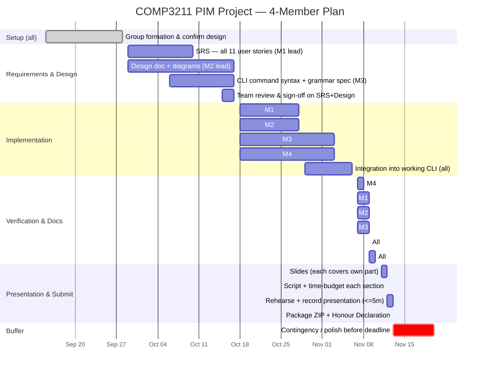

# PIM CLI System — Design Spec

Course: COMP3211 Software Engineering (Fall 2026), Prof. Max Yu Pei
Assignment: [Project Description - 2026.pdf](../../../Project%20Description%20-%202026.pdf)
Deadline: group forming 2026-09-28 09:00; final submission 2026-11-20 20:00
Status: draft — pending group review

## 1. Scope

Command-line Personal Information Management (PIM) system supporting all 11 user
stories in Appendix B of the project description (US1–US11): creating typed
personal information records (PIRs) — plain notes, tasks, events, contacts —
editing them, searching with a boolean criteria language, printing, deleting,
and saving/loading to `.pim` files.

Language/paradigm: **Python, object-oriented.**

Out of scope (per assignment instructions — no extra credit for these):
GUI, networked/online use, anything beyond the 11 user stories.

## 2. Architecture

MVC, adapted for a CLI (View = console formatter, not widgets; Controller =
the read-command loop). This satisfies the assignment's explicit requirement
to place all model code in a package named `model`.

```
pim/
  model/
    pir.py            # PIR (abstract base), Note, Task, Event, Contact, PIR_REGISTRY
    criteria.py        # Criterion tree used by search (see §4)
    criteria_parser.py # tokenizer + recursive-descent parser building Criterion trees
    repository.py      # PIRRepository: in-memory store, CRUD, search
    storage.py         # PimFileStorage: save/load .pim files (JSON)
    errors.py          # ValidationError, PIRNotFoundError, ParseError, StorageError
  controller/
    cli_parser.py      # splits a raw REPL line into a command name + shlex-quoted args
    commands.py         # dispatch table: command name -> handler
  view/
    presenter.py       # formats PIRs/messages for console output
  main.py               # wires model+controller+view, runs the REPL
```

`storage.py` lives in `model`, not a separate layer: it only operates on
model objects and has no CLI/presentation concerns, and keeping it there
means save/load round-trips are covered by the unit-test deliverable, which
is scoped to the model package only.

**Correction (2026-09-16, found while mapping files for the implementation
plan):** the criterion-grammar parser (tokenizer + recursive descent) moved
from `controller/parser.py` into `model/criteria_parser.py`. §8 requires
unit-testing the parser's boolean-expression handling, but the assignment
only requires (and grades) unit tests for the `model` package — leaving the
parser in `controller` would put its correctness outside graded test scope.
The remaining controller-side file is renamed `cli_parser.py`, since it now
only splits a raw command line into a command name plus shlex-quoted
arguments — not the criterion grammar.

**Modularity (coupling direction):** `model` has zero imports from
`controller` or `view` — it depends only on the Python standard library.
`controller` and `view` both depend on `model`'s public interface only,
never on each other's internals, and `view` never mutates state, it only
renders what `controller` hands it. This one-way dependency graph
(`controller` -> `model` <- `view`) is what makes each layer independently
testable and replaceable, and is the concrete basis for the "modularity"
design-quality grading criterion in Appendix A.

### 2.1 Traced scenario: search and update (deliverable 2c)

The design document's mandatory sequence diagram covers "a user searches
for and updates some records." Traced through this architecture as two
sequential REPL commands:

1. User types a `search` command -> `controller/cli_parser.py` splits the
   line into the command name and the raw criterion text ->
   `model/criteria_parser.py` tokenizes that text and builds a `Criterion`
   tree (§4) -> Controller calls `repository.search(criterion)` -> Model
   returns matching `PIR` objects -> Controller hands them to the View's
   `presenter` -> View prints a numbered/ID list.
2. User reads an `id` from that output and types an `edit <id> field=value ...`
   command -> Controller calls `repository.get(id)` (raises
   `PIRNotFoundError`, caught and shown as a friendly message, if the id is
   stale) -> Controller calls `repository.update(id, **fields)` -> Model
   validates the new values and updates `modified_at` -> Controller hands
   the result to the View -> View confirms.

No architectural change is needed to support this — it's two independent
command dispatches sharing the same Model instance. Confirmed here so the
Design Document phase (M2) has a known-working path to draw the diagram
from, rather than discovering a layering problem while drafting it in
October.

## 3. Domain model

`PIR` (abstract base): `id: int` (auto-increment), `created_at`,
`modified_at`, abstract `to_dict()` / `from_dict()`.

| Class | Fields | User story |
|---|---|---|
| `Note` | `text: str` | US2 |
| `Task` | `description: str`, `deadline: datetime` | US3 |
| `Event` | `description: str`, `start_time: datetime`, `alarm: datetime` | US4 |
| `Contact` | `name: str`, `address: str`, `mobile_number: str` | US5 |

**Resolved ambiguity — `Event.alarm`:** the assignment doesn't say whether
alarm is an absolute time or a duration before `start_time`. Decision: it's
an absolute `datetime`, validated at creation/edit time to be `<= start_time`.
This keeps it structurally identical to `Task.deadline` for the purposes of
US7's time comparison operators (`<`, `>`, `=`), avoiding special-cased
duration arithmetic in the criteria evaluator.

**Extendibility fix:** each subclass self-registers into a `PIR_REGISTRY: dict[str, type[PIR]]`
via a class decorator. `add`, `PIR.from_dict`, and the criterion parser's
`type=` field all resolve through this registry instead of an `if/elif`
chain, so adding a 5th PIR type touches one file.

`PIRRepository` holds PIRs in `{id: PIR}`, exposes `add`, `update(id, **fields)`
(US6), `delete(id)` (US9), `get(id)`, `get_all()`, and `search(criterion)`
(US7) which filters via `criterion.matches(pir)`. It tracks a `next_id`
counter rather than computing `max(existing) + 1` on demand, so deleting the
highest-numbered PIR and then adding a new one never reuses an ID a
previously-saved search result might still reference; this counter is
persisted alongside the PIRs (§5) so IDs stay unique across save/load/delete
cycles too.

## 4. Search criteria (US7)

Composite pattern:
- `Criterion` (interface): `matches(pir) -> bool`
- `FieldCriterion(field, op, value)` — leaf. `op` is one of `contains`
  (case-insensitive; text fields: note text, description, name, address,
  mobile number) or `<`, `>`, `=` (time fields: deadline, start_time, alarm).
- `AndCriterion`, `OrCriterion`, `NotCriterion` — composites over `&&`, `||`, `!`.

A hand-written recursive-descent parser (`controller/parser.py`) turns a
query string into a `Criterion` tree. Precedence, tightest first: `!`, `&&`,
`||`; parentheses override. Standard library only (no `eval`).

Rejected alternatives: a flat AND-only condition list (fails US7's
requirement for `||`/`!`/nesting — costs requirements coverage); `eval()` on
a translated boolean string (arbitrary code execution risk, reads poorly in
a design document).

**Cross-type field evaluation:** `PIRRepository.search()` runs a single
criterion across every PIR in the repository regardless of type. If a
`FieldCriterion` names a field the PIR being tested doesn't have (e.g.
`deadline` evaluated against a `Note`), it evaluates to `False` — it never
raises. This is an explicit contract, not an implicit consequence of duck
typing, and gets its own unit test (§8).

**Tokenizing:** string literals (note text, descriptions, names, addresses,
search values) must be quoted (`"..."`) in both `add` and `search` input;
the tokenizer treats `&&`, `||`, `!`, `(`, `)` as operators only outside
quotes. This is what lets a `Note` whose text is literally `cats && dogs`
round-trip correctly instead of being misparsed as a boolean expression.

**Canonical search fields:**

| Field | Applies to | Value type | Operators |
|---|---|---|---|
| `type` | all | registry key | `=` |
| `text` | Note | text | `contains` |
| `description` | Task, Event | text | `contains` |
| `name` | Contact | text | `contains` |
| `address` | Contact | text | `contains` |
| `mobile_number` | Contact | text | `contains` |
| `deadline` | Task | time | `<`, `>`, `=` |
| `start_time` | Event | time | `<`, `>`, `=` |
| `alarm` | Event | time | `<`, `>`, `=` |

**Open items for the group** (finalize during the SRS/Design phase, owned by
M3, see §9):
- Exact command syntax for `add`, `search`, `edit`, `print`, `delete`,
  `save`, `load`. Three downstream deliverables (user manual,
  requirements-coverage report, unit test fixtures) depend on this being
  stable before implementation starts.
- The exact field set shown by "print detailed information about a
  specific PIR" (US8) — decide whether `id`/`created_at`/`modified_at` are
  included alongside the type-specific fields, and use the same list for
  both a single-PIR print and an all-PIRs print.

## 5. Persistence (US10/US11)

`.pim` files are JSON: a top-level object `{"next_id": <int>, "pirs": [...]}`
— an array of PIR dicts, each tagged with a `"type"` field resolved through
`PIR_REGISTRY` on load, plus the repository's `next_id` counter (§3) so IDs
stay unique across save/load/delete cycles. Rejected `pickle`: not
human-readable, executes arbitrary code on load (reliability/security risk),
harder to write a meaningful corrupt-file test against.

**Datetime encoding (contract, not optional):** Python's `json` module
cannot serialize `datetime` objects directly. Every PIR's `to_dict()` must
convert datetime fields via `.isoformat()`; `from_dict()` must reconstruct
them via `datetime.fromisoformat()`. This needs its own unit test — a naive
`json.dump(self.__dict__)` raises `TypeError` on the very first `save`.

**`.pim` extension policy:** `save`/`load` auto-append `.pim` to a filename
that doesn't already end in it, and reject (with a friendly error, not a
crash) a filename ending in a different extension. State this as a
verifiable SRS requirement, e.g.: "the system shall append the `.pim`
extension to a save filename that lacks it, and shall reject a filename
with a conflicting extension."

## 6. Error handling

Exception hierarchy in `model/errors.py`: `ValidationError`,
`PIRNotFoundError`, `ParseError`, `StorageError`. Raised in the model,
caught in the Controller, turned into a friendly message by the View. No
malformed input or corrupt `.pim` file should crash the REPL — this is
written as an explicit, verifiable non-functional requirement in the SRS,
not left implicit.

## 7. Non-functional requirements (for the SRS — verifiable phrasing)

- **Reliability:** the system shall not terminate on malformed command input
  or a corrupt `.pim` file; it shall print an error message and continue.
- **Portability/constraint:** the system shall only import Python
  standard-library modules at runtime. (Dev-only tooling, e.g. `coverage.py`
  for the test-coverage report, is exempt — it's not imported by shipped
  code.)
- **Usability:** every command shall have a `help` entry; an invalid command
  shall print its correct usage rather than a stack trace.
- **Efficiency:** not a design concern at the expected scale of a personal
  PIM (tens to low thousands of records) — an in-memory dict + O(n) search
  is sufficient; no indexing needed.

## 8. Testing strategy

**Granularity guideline:** one test method per behavior, named after the
behavior (e.g. `test_task_without_deadline_raises_validation_error`), not
one broad test per class. This is an explicit Appendix A grading criterion
("test quality: readability and granularity") — apply it consistently
across all four members' test files, not just as an individual habit.

Unit tests target `model` only, per the assignment:
- `pir.py`: field validation per type (e.g. `Task` requires a `deadline`,
  `Event.alarm <= start_time`).
- `repository.py`: CRUD + search correctness, including a criterion field
  that doesn't exist on the PIR being tested evaluating to `False` rather
  than raising (§4).
- `criteria.py` + `criteria_parser.py`: round-trip on nested/parenthesized boolean
  expressions; malformed input raises `ParseError`; a quoted text value
  containing operator characters (e.g. `"cats && dogs"`) parses as literal
  text, not as nested boolean syntax (§4).
- `storage.py`: save/load round trip including datetime fields specifically
  (§5 — this is the case that breaks under a naive implementation);
  corrupt-file handling raises `StorageError`; `next_id` stays unique across
  a delete-then-save-then-load-then-add sequence (§3, §5).

Coverage measured with `coverage.py` (dev-time only, see §7).

## 9. Team plan (4 members)

| Member | Owns |
|---|---|
| M1 | SRS lead, `Note`/`Contact` classes, user manual |
| M2 | Design document lead (diagrams), `Task`/`Event` classes, developer manual |
| M3 | Command grammar spec, `Criterion` parser + Controller, requirements-coverage report |
| M4 | `Repository`/`Storage` (JSON persistence) + View, test-coverage report |

All four implement, all four present (>=1 minute each, per the assignment's
requirement to show face/ID). This is deliberate: the individual grading
formula `min(x*y*z%, x)` rewards documented individual contribution, and
component ownership makes the Honour Declaration's contribution percentages
defensible rather than assumed-equal.

**Presentation time budget:** 4 members × ≥1 minute each already consumes
the full 5-minute cap before covering the three required content items
(creation of a PIR, definition of a search criterion, search for specific
PIRs), the overall design, and lessons learned. Script each section to a
second-level budget before rehearsing — e.g. intros 20s total, three
requirements ~40s each (120s), design overview 60s, lessons learned 30s,
buffer 10s — and track it to the second in rehearsal, not just "each member
covers their part."

## 10. Timeline

Internal completion target **2026-11-13** — one week of buffer before the
hard deadline (2026-11-20 20:00).



**Note:** this Gantt source was revised during the 2026-09-15 QA/grader
review to add the video-storyboard and presentation-scripting sub-tasks
above (see §11). The previously checked export
(`COMP3211 PIM Project-2026-09-15-144047.png`, project root) predates this
change — re-render from the updated source before it goes into the report.
Single-day tasks in "Verification & Docs" and the zero-duration tasks in
"Presentation & Submit" render with truncated/no visible bars in
mermaid.live — cosmetic; widen to 2-day spans if a cleaner report image is
wanted.

## 11. Known residual risks (not eliminated by design alone)

- A 2026-09-15 QA/grader review of this spec found and resolved several
  concrete technical gaps: datetime JSON serialization (§5), cross-type
  search evaluation (§4), ID uniqueness across save/load/delete (§3, §5),
  quoted-string tokenizing (§4), `.pim` extension policy (§5), the
  search+update scenario trace (§2.1), a modularity statement (§2), and
  test granularity guidance (§8). Two items were deliberately left open
  rather than resolved unilaterally — CLI command syntax and the
  detailed-print field list (§4) — since they need the whole team's input
  during the SRS/Design phase.
- Document writing quality, diagram polish, and presentation delivery/timing
  are graded but depend on execution at write-up time, not on this spec.
- SRS requirement wording must stay verifiable (testable) throughout — the
  NFRs in §7 are written as a template; keep functional requirements in the
  same style when the SRS is drafted.
- Command syntax (§4 open item) must be locked before implementation starts,
  or the user manual, tests, and requirements-coverage report will drift
  from the actual CLI.
